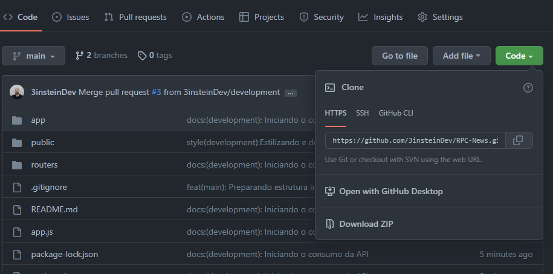
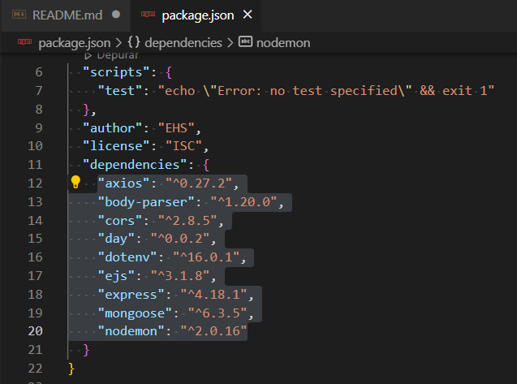

# Aplicação Web com a programção disponível

## Objetivo

O objetivo deste Repositório é construir uma Aplicação que consuma uma API que nos fornece um Objeto contendo a programação do dia escolhido. 
Além do consumo, fornecer estes dados em um front-end, seguindo um escopo.

Foi desenvolvido em Node.js, com a template engine EJS e as seguintes dependencias:
  * Axios
  * Body-parser
  * Cors
  * Dayjs
  * dotenv
  * ejs
  * Express
  * Mongoose
  * Nodemon

## Como usar

### Clonar

Para clonar siga os seguintes passos:

* Aqui no GitHub, na página principal deste repositório, clique em => código

    

* Copie a URL deste repositório
* Use o prompt de comando/ terminal do VSCode e acesse um diretório para o qual deseja clonar
* Digite git clone (clonar git) e cole a URL que você copiou anteriormente.

git clone https://github.com/3insteinDev/RPC-News.git

* Após clonado, acesse o diretório pelo terminal, digitando o seguinte comando:

cd ./RPC-NEWS

### Instalar dependencias
* Após acessar o diretório RPC-NEWS, Digite o seguinte comando no terminal:

npm install   ou   npm i

Ao acessar o arquivo package.json, na parte de dependências irá aparecer estas:

    

### Rodar servidor

Com um dos seguintes comandos será possível iniciar o servidor 

node app
 ou
nodemon app

no seguinte endereço:

http://localhost:3000/index

## Observação
* Projeto em Andamento ...